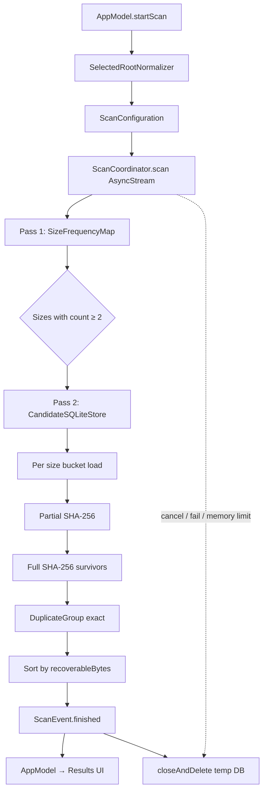
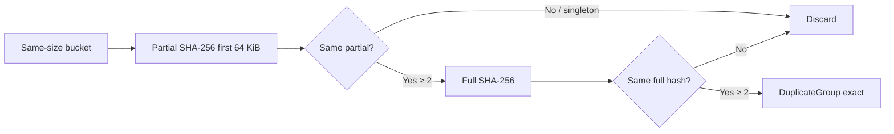
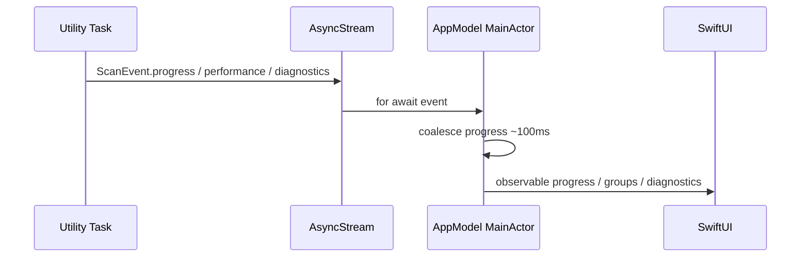

# CopyCat Engine Architecture

**Status:** Frozen reference for the scanning engine as implemented today  
**Package:** `Packages/CopyCatEngine`  
**Platform:** macOS 14+  
**Last reviewed:** 2026-07-18  

This document describes **how the engine works today**. It is not a roadmap. It does not propose changes. Future UI work should treat this architecture as stable unless a deliberate engine revision is planned and benchmarked.

---

## 1. Overview

CopyCat’s scanning engine finds **exact duplicate files** by content: same byte size, matching partial SHA-256, then matching full SHA-256. The product surface is a native macOS app; the engine lives in the Swift package `CopyCatEngine` and is driven by `AppModel` over an `AsyncStream` of `ScanEvent`s.

### Design goals

1. **Correctness first** — Only files that match full SHA-256 are reported as exact duplicates.
2. **Bounded memory** — Avoid holding the whole filesystem tree (paths + metadata) in RAM during discovery.
3. **Balanced I/O** — Prefer smooth, sequential, single-reader disk access over peak parallel throughput.
4. **Responsive host** — Utility priority, cooperative yields, rate-limited UI updates, soft memory circuit breaker.
5. **Clean lifecycle** — Temporary candidate storage is created for a scan and deleted when the scan ends (finish, cancel, or fail).

### Why this architecture

Earlier approaches that retained large in-memory candidate sets (paths for every size collision) scaled poorly on real libraries where many unrelated files share common sizes. The current design separates:

- **Pass 1:** cheap size counting (no paths).
- **Disk-backed index:** only colliding sizes get path metadata, in a temporary SQLite database.
- **Hashing:** one size bucket at a time, one file at a time, with reusable read buffers.

That split keeps Pass 1 light, moves candidate retention off the heap, and keeps the hash working set proportional to the largest same-size bucket rather than the whole tree.

### Core principles

| Principle | Meaning in this codebase |
|-----------|---------------------------|
| Exactness | Full SHA-256 match is required for a duplicate group |
| Streaming discovery | Enumerate → decide → discard; do not accumulate the tree |
| Single reader (Balanced) | At most one full-file hasher open at a time |
| Ephemeral candidates | Temp SQLite lives only for the scan |
| Cooperative concurrency | One utility `Task`, yields, cancellation checks — not a thread pool of hashers |

### Performance philosophy

**Balanced mode** (the only `PerformanceMode` today) optimizes for steadiness and host politeness:

- Sequential directory-clustered hashing order
- Adaptive streaming buffers (up to 1 MB capacity)
- No parallel hasher pool
- Progress and diagnostics sampled on intervals, not per file on the MainActor

Peak MB/s is secondary to “does not thrash a mechanical drive or freeze the Mac.”

### Safety philosophy

- Skip unreadable / vanished files; do not abort the whole scan for one bad path
- Soft RSS ceiling: fail the scan with a calm message rather than grow without bound
- Cancel cooperatively via `Task.checkCancellation()` and stream termination
- Always attempt to close and delete the temporary candidate database on exit paths

---

## 2. High Level Pipeline



End-to-end: **folder selection → Pass 1 (sizes) → temp SQLite candidates → per-bucket hash verification → duplicate groups → UI**.

---

## 3. Scan Lifecycle

### Initialization

1. User selects folders; `AppModel` retains security-scoped URLs.
2. `startScan()` clears prior groups/errors, sets `screen = .scanning`, `isScanning = true`.
3. Roots are normalized (`SelectedRootNormalizer`).
4. `ScanConfiguration` is built (exclusions, skip zero-byte files, Balanced mode, memory limit).
5. `ScanCoordinator.scan(configuration:)` cancels any prior task, creates an `AsyncStream`, and starts a **`Task(priority: .utility)`**.
6. A fresh `ExactDuplicateDetector(mode: .balanced)` is created for this scan (dedicated reusable reader).

### Progress

While the utility task runs, it yields `ScanEvent` values:

| Event | Role |
|-------|------|
| `.progress(ScanProgress)` | Phase, counts, optional performance snapshot |
| `.performance(PerformanceSnapshot)` | Telemetry sample |
| `.diagnostics(ScanDiagnostics)` | Developer metrics (UI only in DEBUG) |
| `.groupsUpdated` | Final groups before finish (classification step) |
| `.finished` / `.cancelled` / `.failed` | Terminal |

`AppModel` coalesces progress onto the MainActor (~100 ms) so SwiftUI is not updated per file.

### Cancellation

- UI calls `AppModel.cancelScan()` → `ScanCoordinator.cancel()` → cancels the utility task.
- Stream `onTermination` also cancels the task.
- Cooperative checks (`Task.checkCancellation`) in enumeration and hashing unwind to `CancellationError`.
- Coordinator releases Pass-1 state, closes/deletes SQLite, emits `.cancelled`.

### Completion

1. Hashing finishes; temp DB is deleted.
2. Groups sorted by recoverable bytes (descending).
3. Phase `.classifying` → `.groupsUpdated` → `.finished`.
4. `AppModel` stores groups, clears `isScanning`, and after a short delay (~1100 ms) navigates to results (allows completion presentation).

### Cleanup

On finish, cancel, failure, or memory-limit trip:

- `SizeFrequencyMap` cleared
- `CandidateSQLiteStore.closeAndDelete()` removes the DB file and its temp directory
- No intentional retention of candidate paths after hashing

---

## 4. Pass 1

### Purpose

Discover which **file sizes** appear at least twice. Those sizes are the only ones worth hashing later.

### Responsibilities

- Walk all configured roots (`FileEnumerator`)
- Read **file size only** (`MetadataReader.fileSize`)
- Record counts in `SizeFrequencyMap`
- Emit coarse progress (every 200 files)
- Enforce the memory circuit breaker periodically

### What is collected

| Retained | Not retained |
|----------|--------------|
| `size → count` map | Paths / URLs |
| `filesDiscovered`, `bytesDiscovered` | Dates, names, hashes |
| After pass: `Set` of colliding sizes | Per-file metadata |

Zero-byte files are skipped when `skipZeroByteFiles` is true (default).

### Why hashing is not performed here

Most files on a Mac have unique sizes. Hashing them would burn CPU and disk for zero duplicate yield. Pass 1 answers a cheaper question: “which sizes can possibly collide?” without paying for SHA-256 or path retention.

### Memory characteristics

`SizeFrequencyMap` holds one `UInt32` count per distinct size. After `takeCollisionSizes()`, the count table is cleared. Peak Pass-1 memory is dominated by the walk itself and the size histogram—not by path strings.

### Performance considerations

- Async enumeration yields every **200** files to keep the runtime responsive
- Metadata is size-only (cheaper than full `ScannedFile` construction)
- Progress attachment is telemetry-rate-limited; UI coalescing is further applied in `AppModel`

### Failure handling

- Unreadable / missing files during size probe: **skip and continue**
- Cancellation: abort Pass 1, cleanup, `.cancelled`
- RSS over limit: abort with memory-limit failure message

---

## 5. SQLite Candidate Store

### Why SQLite is used

Pass 2 must remember **path + size + dates** for every file whose size collides. Holding that set entirely in RAM was the primary memory failure mode on realistic trees (many files share common sizes). A per-scan temporary SQLite database moves that working set to disk and allows loading **one size bucket at a time** for hashing.

### Database schema

Table `candidates`:

| Column | Type | Meaning |
|--------|------|---------|
| `id` | INTEGER PK | Row id |
| `size` | INTEGER | File size (bytes) |
| `path` | TEXT | Absolute path |
| `created_at` | REAL nullable | Creation time (time interval since 1970) |
| `modified_at` | REAL nullable | Modification time |

Index: `idx_candidates_size` on `size`.

### Indexes and queries

- Insert path: batched transactions
- `collidingSizes`: `GROUP BY size HAVING COUNT(*) >= 2 ORDER BY size`
- `scannedFiles(forSize:)`: `WHERE size = ? ORDER BY path COLLATE NOCASE` (directory locality for hashing)
- Diagnostics: largest colliding bucket count; on-disk DB byte size (best-effort)

### Batching

Default batch size **500** inserts per transaction (`BEGIN` … flush `COMMIT` / new `BEGIN`). `finishInserts()` flushes the remainder.

### Temporary file management

- Location: `FileManager.temporaryDirectory/CopyCatScan-<UUID>/candidates.sqlite`
- Open flags: create + read/write + full mutex
- PRAGMA: `journal_mode=WAL`, `synchronous=NORMAL`

### Cleanup

`closeAndDelete()`:

1. Finalize prepared statements  
2. `ROLLBACK` any open transaction  
3. Close DB  
4. Delete the temporary directory  

Also invoked from `deinit` as a safety net. Coordinator calls this on successful hash completion and on cancel/fail/memory-limit paths.

### Memory benefits

- Candidate paths are not all resident as Swift objects during Pass 2 accumulation
- Hashing loads only one size’s rows into `[ScannedFile]`
- After hashing, the DB is deleted before results are presented

### Trade-offs

| Benefit | Cost |
|---------|------|
| Bounded RAM for candidates | Extra disk I/O and SQLite overhead |
| Stable reload by size | Temp space in `/tmp` during the scan |
| Path-ordered reads | Sort cost at query time |

---

## 6. Pass 2

### How candidate buckets are loaded

1. After Pass 1, coordinator holds `collisionSizes: Set<UInt64>`.
2. Tree is walked again. For each regular file, full metadata is read; if `size ∈ collisionSizes`, a row is inserted into SQLite.
3. After inserts finish, `collidingSizes()` returns sizes that still have ≥ 2 rows.
4. For each size, `scannedFiles(forSize:)` loads that bucket into memory as `[ScannedFile]`.

Unique sizes never enter the store. Sizes that somehow end with &lt; 2 rows are skipped at hash time.

### Hash scheduling

- **Sequential:** one size bucket after another
- **Within a bucket:** directory-then-name stable order, then partial hash all, then full hash only partial-collision survivors
- **Concurrency:** one active hasher (`PerformanceMode.balanced.maxConcurrentHashReaders == 1`)
- **Yield:** between file batches and between size buckets

### Verification process



### Duplicate confirmation

A `DuplicateGroup` is created only when ≥ 2 files share the same full SHA-256. Category is `.exact`; reason is `.identicalSHA256`.

### Result generation

- Groups accumulate across size buckets
- Sorted by `recoverableBytes` descending (`size × (fileCount − 1)` using the first file’s size)
- Emitted via `.groupsUpdated` then `.finished`

---

## 7. Hash Engine

### SHA-256 implementation

Apple **CryptoKit** `SHA256`. Digests are hex-encoded lowercase strings for grouping.

### Buffer reuse

`ReusableHashReader` owns a single `UnsafeMutableRawPointer` buffer for the scan. Partial and full hashing share that instance. Reads use POSIX `read` into the buffer; CryptoKit is updated from the buffer pointer. **File contents are not retained as `Data` after hashing.**

### Adaptive buffer sizing

Allocated capacity: up to **1 MB** (Balanced).

Active read chunk per full-hash:

| File size | Chunk |
|-----------|--------|
| ≤ 64 KiB | One-shot (`fileSize` bytes) |
| ≤ 4 MiB | 512 KiB |
| &gt; 4 MiB | up to 1 MiB |

Partial hashing always reads at most the first **64 KiB**.

### One-shot vs streaming

- Small files: single `read` for the whole file (full hash) or for the partial window
- Larger files: loop `read` → `hasher.update` until EOF

### Hasher reuse

`ExactDuplicateDetector` constructs one shared `ReusableHashReader`, wraps it in `PartialHasher` and `FullHasher`, and reuses them for the entire scan. `activeHasherCount` is always **1** in Balanced mode.

### Threading model

Hashing runs on the coordinator’s utility task (not MainActor). No hasher thread pool. Opens enable `F_RDAHEAD` for sequential read-ahead hints.

### Memory behaviour

- One buffer allocation for the scan
- `autoreleasepool` around each file hash in the detector
- Per-file open → read → close; no handle cache across files

---

## 8. File Ordering Strategy

### Directory clustering

`ExactDuplicateDetector.stableDiskOrder` sorts by:

1. Parent directory path (`localizedStandardCompare`)
2. Filename within that directory

### Path ordering at load

SQLite loads buckets with `ORDER BY path COLLATE NOCASE`, which approximately clusters by directory prefix before the detector re-sorts.

### Why this helps HDDs

Mechanical drives pay heavily for random seeks. Hashing same-folder files together keeps the head in a locality neighborhood longer than dictionary iteration order or insert order alone.

### Trade-offs

- Sort cost is CPU-cheap relative to hashing I/O
- Does not use inode/B-tree physical order (not available portably)
- Partial → full re-read of survivors still revisits those paths (inherent to the algorithm)

### SSD considerations

SSDs tolerate random access better. Ordering must not materially regress SSD time; warm fixtures have shown parity within noise. The strategy remains enabled for both media types for a single code path.

---

## 9. Progress Reporting

### What is reported

`ScanProgress` carries:

- `phase` (`enumerating` → `grouping` → `hashing` → `classifying` → terminal)
- `filesSeen`, `bytesSeen` (Pass-1 discovery totals retained through the scan)
- `candidateFiles`, `groupsFound`
- `message` (user-facing pass labels)
- optional `performance` snapshot

Phase messages use `ScanProgressLabels` (e.g. indexing sizes, collecting candidates, partial/full hashing, preparing results).

### How progress reaches SwiftUI



### Rate limiting

| Layer | Interval |
|-------|----------|
| Pass 1 UI progress emit | every 200 files |
| Pass 2 UI progress emit | every 100 candidates or 200 files |
| Hashing UI progress | ~100 ms, or immediately when group count changes |
| `PerformanceTelemetry` | ~250 ms |
| `ScanDiagnostics` emit | ~500 ms |
| `AppModel` MainActor publish | ~100 ms coalesce |

### Real scan events

Terminal and structural events (`.finished`, `.cancelled`, `.failed`, `.groupsUpdated`) are not subject to the same coalesce rules; diagnostics apply immediately to `AppModel.diagnostics`.

---

## 10. Memory Management

Implemented today:

| Mechanism | Role |
|-----------|------|
| Pass 1 size histogram only | No path retention during discovery |
| `takeCollisionSizes` + clear | Drop histogram after extracting collisions |
| Temp SQLite candidates | Paths off-heap during Pass 2 accumulation |
| One size bucket in RAM | Hash working set ≈ largest colliding size group |
| Shared `ReusableHashReader` | Avoid per-chunk `Data` allocations |
| Adaptive chunks | Cap streaming window at 1 MB |
| `autoreleasepool` | Pass 1/2 callbacks and per-file hashing |
| RSS circuit breaker | Every 250 files (+ forced at boundaries); fail scan if over limit |
| Limit formula | `min(max(physical/4, 512 MB), 1 GB)` unless overridden |
| Store `closeAndDelete` | Drop temp DB before/with terminal events |
| No retained file bytes post-hash | Buffer reused; digests are short hex strings |

Peak RSS on small Balanced fixtures (see §19) is on the order of **~15–16 MB** process RSS for those corpora. Larger real libraries scale primarily with **largest same-size bucket** during hashing and OS file-cache pressure, not with a full in-RAM path index.

---

## 11. Performance Optimizations

| Optimization | Purpose | Benefit | Trade-off |
|--------------|---------|---------|-----------|
| Two-pass architecture | Avoid hashing unique sizes | Huge reduction in hash I/O | Second tree walk |
| SQLite candidates | Bound RAM for paths | Survives common-size trees | Temp disk + SQL overhead |
| Per-size hash batches | Cap in-RAM hash inputs | Predictable peaks | Reload cost per size |
| Single-reader Balanced | Avoid disk thrashing | Steady HDD behaviour | Lower peak throughput |
| Directory/path ordering | Reduce seeks | Smoother mechanical I/O | Sort cost |
| Reusable buffer | Cut allocator churn | Lower heap spikes | 1 MB reserved capacity |
| Adaptive chunks | Fit small vs large files | Less overhead on tiny files; larger windows on big files | Extra size-aware logic |
| Partial then full hash | Cheap reject | Skip full reads for many near-misses | Survivors read twice |
| Utility task priority | Stay polite | Better interactivity | Slightly less aggressive scheduling |
| Enumerator yield /200 | Keep runtime responsive | Less UI jank during walks | Tiny throughput cost |
| Hash yield /16 files | Cooperative multitasking | Host stays usable | Slightly longer wall time |
| Thermal / Low Power tighter yields | Soft politeness | Less heat/battery pressure | Slower under pressure |
| Progress throttling | Protect MainActor | Smooth UI | Coarser live counters |
| Telemetry 250 ms | Cheap metrics | Observability without spam | Rolling estimates, not instant |
| `F_RDAHEAD` | Hint sequential reads | Helps HDD readahead | OS-dependent |
| Root normalization | Avoid duplicate walks | Less redundant I/O | Path resolution cost |
| Skip hidden / packages / symlinks / exclusions | Stay in user data | Safety + speed | May miss edge locations |

---

## 12. Threading Model

### Actors

- `ScanCoordinator` is an **`actor`**. Scan orchestration and cancel hop through the actor; the long-running work executes inside a child `Task` created from `scan`.

### Tasks

- One unstructured `Task(priority: .utility)` per scan owns enumeration, SQLite, and hashing.
- `AppModel` uses a separate `Task` to `for await` the stream and hop to MainActor for UI state.

### TaskGroups

**Not used.** There is no parallel hash fan-out and no parallel root walk via `TaskGroup`.

### MainActor

- UI state (`AppModel`, SwiftUI views) is MainActor-oriented.
- Engine work is **not** MainActor-bound.
- Progress is coalesced before touching observable UI fields.

### Cancellation

- `cancel()` cancels the utility task.
- Stream termination cancels the task.
- Hash/enumerate loops check cancellation cooperatively.

### Synchronization

- SQLite opened with `FULLMUTEX`
- `ReusableHashReader` / `CandidateSQLiteStore` are `@unchecked Sendable` but used from the single scan task (no concurrent hashers)
- No additional locks in the hash path

---

## 13. Diagnostics System

### Developer Diagnostics

`ScanEvent.diagnostics(ScanDiagnostics)` carries a structured snapshot. The scanning UI shows `ScanDiagnosticsDebugPanel` **only in DEBUG** builds (`ContentView` safe-area inset). Release UI must not surface this panel.

### Metrics collected

Phase, files/s, MB/s, RSS, peak RSS, largest SQLite bucket, SQLite row count, temporary DB bytes, average hash latency, average full-hash latency, active read buffer size, active hasher count, Pass 1 / Pass 2 / hashing durations, read operations, average bytes per opened file, approximate disk-wait seconds.

### How metrics are measured

| Metric | Source |
|--------|--------|
| files/s, bytes/s, read ops/s | Rolling meters (~2 s window) in `PerformanceTelemetry` |
| RSS / peak | `ProcessMemorySampler` + `ScanDiagnosticsTracker` |
| Hash / full-hash latency | Nanosecond timers around hash operations in `ReusableHashReader` |
| Disk wait | Time spent inside `read()` calls (approximation of I/O wait) |
| Phase timings | Tracker clocks around Pass 1 / Pass 2 / hashing |
| SQLite stats | Store row count, largest bucket query, file size attributes |

### Debug-only behaviour

- Event is emitted in all builds (harmless for CLI/benchmarks)
- **Panel compiled out** of Release via `#if DEBUG`

### Performance overhead

Diagnostics emit ~every 500 ms when telemetry attaches; forced at phase boundaries. Hot paths avoid per-file MainActor publishes. Overhead is small relative to hashing I/O on HDD; on tiny SSD fixtures, telemetry/diagnostics timing can dominate wall-clock noise.

---

## 14. Error Handling

| Situation | Behaviour |
|-----------|-----------|
| Permission / unreadable file | Skip file; continue scan |
| File missing between passes | Skip; continue |
| Hash open/read failure | Skip that file; continue bucket |
| User cancel | Cleanup temp DB; `.cancelled` |
| RSS over soft limit | Cleanup; `.failed` with fixed user-facing memory message |
| SQLite open/insert/exec failure | Propagate; `.failed` with localized description; cleanup attempted |
| Other unexpected errors | `.failed` with `localizedDescription`; cleanup attempted |
| Disk full (SQLite write) | Surfaces as store/exec failure → failed scan |

There is no automatic retry loop. Recovery for the user is: choose a smaller scope, exclude heavy trees, or free memory/disk and rescan.

---

## 15. Engine Components

### `ScanCoordinator` (actor)

- **Purpose:** Orchestrate the full scan pipeline and stream events  
- **Responsibilities:** Pass 1/2, hashing loop, telemetry, diagnostics, memory checks, cleanup  
- **Collaborators:** `FileEnumerator`, `MetadataReader`, `ExactDuplicateDetector`, `SizeFrequencyMap`, `CandidateSQLiteStore`, `PerformanceTelemetry`  
- **Lifecycle:** Long-lived actor; one active scan task at a time  

### `FileEnumerator`

- Walks roots with `FileManager` enumerator  
- Skips hidden files, package descendants, symlinks; applies directory name exclusions  
- Sync and async APIs; async yields every 200 files  

### `MetadataReader`

- Pass 1: `fileSize`  
- Pass 2: full `ScannedFile` metadata  

### `SizeFrequencyMap`

- Compact `size → count` histogram for Pass 1  

### `CandidateSQLiteStore`

- Temp DB for colliding-size candidates; batched insert; bucket load; delete-on-close  

### `ExactDuplicateDetector`

- Partial → full SHA-256 grouping; stable disk order; async yields  

### `ReusableHashReader` / `PartialHasher` / `FullHasher`

- I/O + CryptoKit hashing stack  

### `ScanConfiguration` / `SelectedRootNormalizer` / `PerformanceMode`

- Inputs and Balanced policy knobs  

### `ScanProgress` / `ScanEvent` / `PerformanceSnapshot` / `ScanDiagnostics`

- Wire format to the app  

### `ProcessMemorySampler` / `SystemLoadHints`

- RSS sampling; Low Power / thermal yield adjustment  

### `DuplicateGroup` / `ScannedFile`

- Result and file models  

### Legacy (not on production path)

- `SizeCollisionIndex`, `FileCandidate` — retained for tests/helpers; **not** used by `ScanCoordinator` today  

### App boundary

- `AppModel` — security scope, stream consumption, UI state, progress coalesce, DEBUG diagnostics storage  

---

## 16. Data Flow

```mermaid
flowchart TB
  subgraph App
    UI[SwiftUI views]
    AM[AppModel]
  end

  subgraph Engine["CopyCatEngine"]
    SC[ScanCoordinator actor]
    FE[FileEnumerator]
    MR[MetadataReader]
    SFM[SizeFrequencyMap]
    DB[(Temp SQLite)]
    DET[ExactDuplicateDetector]
    RH[ReusableHashReader]
    TEL[PerformanceTelemetry]
  end

  UI -->|startScan / cancelScan| AM
  AM -->|scan configuration| SC
  SC --> FE
  FE --> MR
  MR -->|sizes| SFM
  SFM -->|collision sizes| SC
  SC --> DB
  FE -->|pass 2 paths| DB
  DB -->|one size bucket| DET
  DET --> RH
  RH -->|digests| DET
  DET -->|groups| SC
  SC --> TEL
  SC -->|AsyncStream ScanEvent| AM
  AM -->|@Observable| UI
```

---

## 17. Current Limitations

Documented as present constraints—not a commitment to fix:

1. **Second full tree walk** — Pass 2 re-enumerates roots; metadata I/O is paid twice.
2. **Common-size fan-out** — If most files share a few sizes (e.g. many identical empty-ish or same-encoded assets), SQLite and hashing still process large buckets.
3. **Partial + full re-read** — Survivors of partial collision are read again for full SHA-256.
4. **Single Balanced mode** — No Fast/Turbo mode; no user-facing performance controls.
5. **No parallel hashing** — Intentional for disk friendliness; leaves CPU headroom unused on SSD-heavy machines.
6. **No incremental / watch-mode scans** — Every scan is a full configured-root pass.
7. **Exact duplicates only** — No perceptual image/video similarity; `DuplicateCategory.likely/possible` exist in the model but are unused by the detector.
8. **No inode/physical block ordering** — Path/directory clustering is a heuristic.
9. **Disk queue depth unavailable** — Sandboxed APIs do not expose it; field stays nil.
10. **Security-scoped roots only as selected** — Engine trusts the URLs the app can access; no cloud-provider-specific logic.
11. **Temp space** — Candidate DB needs free space in the temp directory for the duration of the scan.
12. **Progress during hashing is approximate** — Phase ladder / group counts, not a precise byte fraction of the disk.

---

## 18. Extension Points

Natural integration seams **without** rewriting the two-pass spine:

| Future feature | Likely seam |
|----------------|-------------|
| Near-duplicate images | New detector stage after exact groups, consuming paths from results—not replacing SHA-256 |
| Video similarity | Same: post-pass or parallel feature pipeline on selected groups |
| AI ranking / “keep which file” | UI + ranking over `DuplicateGroup`; engine remains exact oracle |
| Cloud / network volumes | `FileEnumerator` / configuration policy (timeouts, exclusions); keep single-reader Balanced |
| Incremental scans | Persist a content-index outside temp DB; invalidate by mtime/size; still feed colliding sizes into the same hash path |
| File monitoring | FSEvents → dirty roots → incremental rescan entry point on `ScanCoordinator` |
| Faster SSD mode | New `PerformanceMode` case with explicit concurrency policy—must not silently change Balanced |
| Alternative digests | Behind hasher protocol; exactness contract stays content-hash equality |

Rule of thumb: **exact SHA-256 groups remain the source of truth**; smarter features should layer above or beside that oracle.

---

## 19. Performance Summary

### Architecture (current)

Two-pass · temp SQLite candidates · per-size sequential hashing · single reusable reader · CryptoKit SHA-256 · utility task · RSS circuit breaker.

### Buffer strategy

- Capacity ≤ **1 MB**  
- Active chunk: one-shot ≤64 KiB · **512 KiB** mid · **1 MB** large  
- Partial window: **64 KiB**

### Hash strategy

One hasher · directory-clustered order · partial then full · yields every 16 files (8 under elevated thermal / Low Power).

### Benchmarks (Balanced polish, 2026-07-18)

Fixtures: SSD 200×2 MB files; HDD 100×2 MB on `MERVIN 12TB`.

| Metric | SSD (warm after) | HDD (warm after) |
|--------|------------------|------------------|
| Duration | ~0.14 s | ~12.4 s |
| files/s | ~1400 | ~8 |
| Wall MB/s | cache-dominated | ~16 |
| Hash MB/s | — | ~13.6 |
| Peak RSS | ~16 MB | ~16 MB |
| Read ops | 680 | 340 |
| Exact groups | 60 | 30 |
| diskWait vs hash | — | diskWait ≈ hash time (I/O bound) |

SQLite behaviour: insert batched (500); load one size ordered by path; DB deleted before results UI.

---

## 20. Design Decisions

### Why two-pass

Unique sizes cannot be exact duplicates. Counting sizes first eliminates most of the corpus from expensive hashing without storing paths.

### Why SQLite

In-memory candidate arrays for “all colliding sizes” approached whole-tree retention on real libraries. SQLite provides a spill path and random access by size with acceptable overhead.

### Why SHA-256

Cryptographic content equality is unambiguous for “exact duplicate,” widely available (CryptoKit), and matches user expectation for a duplicate finder that claims exactness.

### Why reusable buffers

Per-read `Data` allocation produced large transient heap spikes during hashing. A single reusable buffer keeps peak allocator pressure predictable.

### Why path / directory ordering

Balanced mode targets mechanical drives and overall system smoothness. Stable locality reduces seek noise compared to hash-map iteration order.

### Why diagnostics

Engineers need files/s **and** MB/s, RSS, bucket sizes, and phase timings. Diagnostics exist so performance work is measured, not guessed—without exposing knobs in Release UI.

### Why rate-limited UI updates

Hashing can touch tens of thousands of files. Updating SwiftUI per file saturates the MainActor. Coalescing preserves correctness of eventual counts while keeping the app interactive.

### Why a soft memory circuit breaker

Unbounded growth is worse than a failed scan. The breaker stops the run with a clear message when RSS exceeds a fraction of physical memory (capped).

### Why only Balanced today

Shipping one well-characterized I/O posture avoids a matrix of modes before the product’s UX and correctness story are frozen. Additional modes would be new API surface, not a silent change to Balanced.

---

## 21. Future Contributors Guide

### Coding principles

- Prefer clarity over cleverness in the scan pipeline  
- Keep the production path (`ScanCoordinator` → SQLite → `ExactDuplicateDetector`) obvious  
- Do not revive `SizeCollisionIndex` on the production path without an explicit design review  

### Performance principles

- Balanced means **one reader**, sequential bias, polite yields  
- Measure with `scripts/DiskIOBenchmark` (and diagnostics) on **SSD and HDD** before claiming wins  
- files/s alone is insufficient; include MB/s, RSS, read ops, phase timings  

### Memory principles

- Never reintroduce whole-tree path retention in Pass 1  
- Load one size bucket at a time for hashing  
- Do not retain file bytes after hashing  
- Keep the circuit breaker behaviour unless replacing it with a stronger safety story  

### Safety rules

- Skip bad files; do not fail the entire scan for a single EPERM/ENOENT during walk/hash  
- Always `closeAndDelete` temp DBs on terminal paths  
- Cancellation must remain cooperative and prompt  

### What must never be broken

1. Exact groups require full SHA-256 equality  
2. Temp candidate DB lifecycle (create → use → delete)  
3. Two-pass size filtering semantics  
4. Single-reader Balanced guarantee  
5. Soft memory limit fail-closed behaviour  

### What requires benchmarking before changing

- Buffer sizes and adaptive thresholds  
- Yield cadences  
- SQLite batch sizes  
- Ordering strategy  
- Any introduction of concurrent readers  

### What requires profiling before optimizing

- Suspected leaks (use `leaks` / Instruments; prior audits found retention, not leaks)  
- MainActor stalls (check progress coalesce first)  
- “Slow on SSD” claims (verify cold vs warm cache)  
- HDD thrashing claims (need seek-heavy corpora, not only large sequential files)  

### Documentation

When the engine changes intentionally, update this file in the same change set. If behaviour diverges from this document, the code is wrong **or** this document is stale—resolve the conflict deliberately.

---

## Appendix A — Source map

```
Packages/CopyCatEngine/Sources/CopyCatEngine/
  Coordination/   ScanCoordinator, ScanAuditHooks
  Detection/      SizeFrequencyMap, CandidateSQLiteStore, ExactDuplicateDetector,
                  SizeCollisionIndex (legacy)
  Enumeration/    FileEnumerator, MetadataReader
  Hashing/        PartialHasher, FullHasher, ReusableHashReader
  Models/         ScanConfiguration, ScanEvent, ScannedFile, DuplicateGroup, …
  Performance/    Telemetry, meters, ProcessMemorySampler, ScanDiagnostics, SystemLoadHints
```

App boundary: `CopyCat/AppModel.swift`  
DEBUG panel: `CopyCat/Features/Scanning/ScanDiagnosticsDebugPanel.swift`  
Benchmark harness: `scripts/DiskIOBenchmark`

---

## Appendix B — Phase cheat sheet

| Phase | Engine work | Typical message |
|-------|-------------|-----------------|
| `enumerating` | Pass 1 size counts | Indexing file sizes… |
| `grouping` | Pass 2 SQLite inserts | Collecting duplicate candidates… |
| `hashing` | Partial/full SHA-256 | Partial / full hashing labels |
| `classifying` | Sort groups | Preparing results… |
| `finished` / `cancelled` / `failed` | Terminal | — |

---

*End of frozen engine architecture reference.*
